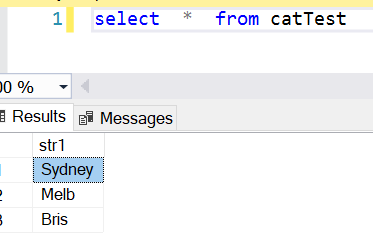

# Let's learn about String Aggregate in SQL Server

Sample code :
```
create table catTest
(
 str1 varchar(15),
);

insert into catTest (str1)
values ('Sydney'), ('Melb'), ('Bris')
```

Query to get the string Aggregate:


```
select  STRING_AGG(str1, ', ') WITHIN GROUP (order by str1)
    from catTest
```


A simple way to understand about String Agg is that it like any other aggregate functions but the aggregaration is applied over strings. Just like we use group by on numeric data, STRING_AGG can be applied on any data because the any data can be converted to string type and then aggregation can be applied on that.

Try this on your own :
```
Use AdventureWorks

create table CountryCities
(
	country nvarchar(30),
	city nvarchar(30),
);


insert into CountryCities values
('US','NY'),
('US','LA'),
('US','Miami'),
('UK','London'),
('UK','Belfast')

select STRING_AGG(city,',') as CitiesList from CountryCities

select country, STRING_AGG(city,'-') as CitiesList from CountryCities group by country
```


